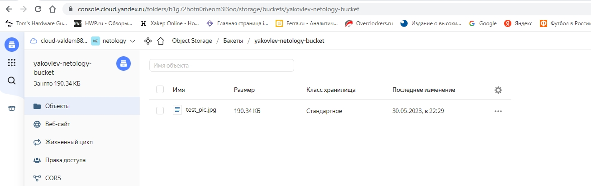
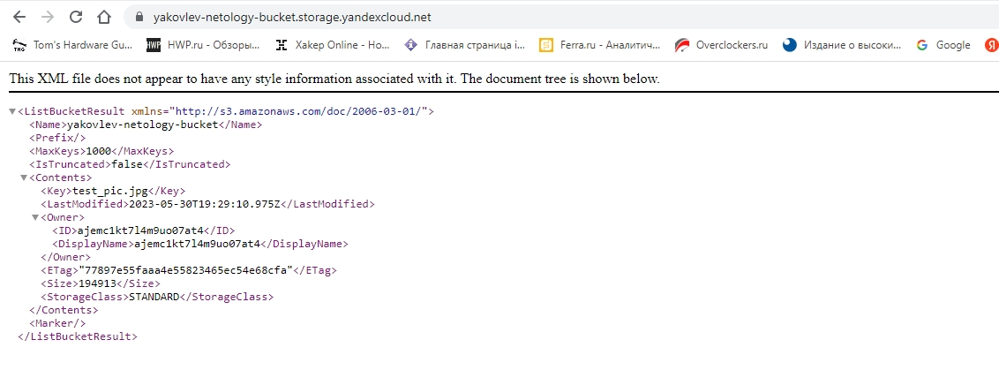
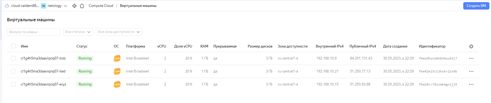
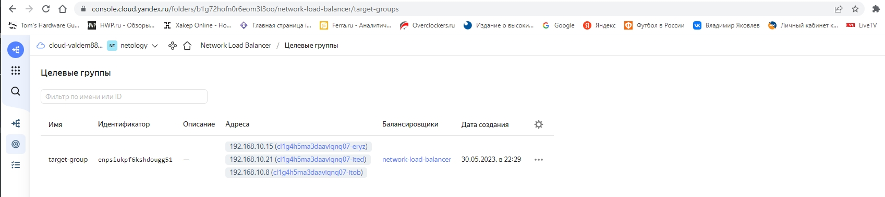
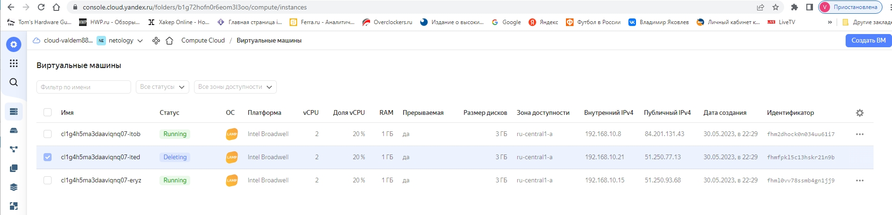
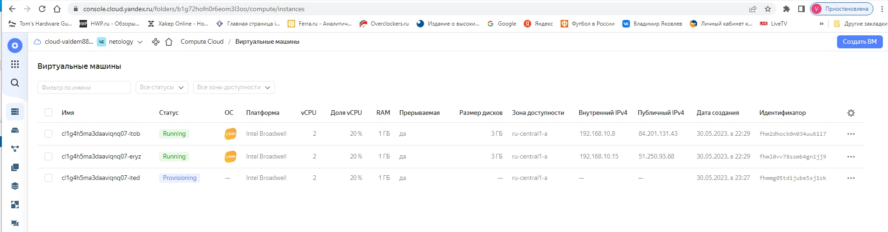
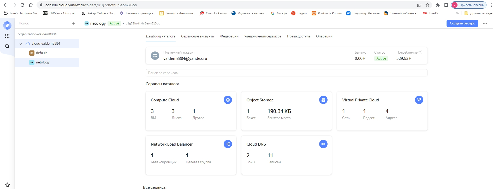

# Домашнее задание к занятию «Вычислительные мощности. Балансировщики нагрузки» dev-17_kuber-homeworks-clopro-15.2-yakovlev_vs
«Вычислительные мощности. Балансировщики нагрузки»

### Подготовка к выполнению задания

1. Домашнее задание состоит из обязательной части, которую нужно выполнить на провайдере Yandex Cloud, и дополнительной части в AWS (выполняется по желанию). 
2. Все домашние задания в блоке 15 связаны друг с другом и в конце представляют пример законченной инфраструктуры.  
3. Все задания нужно выполнить с помощью Terraform. Результатом выполненного домашнего задания будет код в репозитории. 
4. Перед началом работы настройте доступ к облачным ресурсам из Terraform, используя материалы прошлых лекций и домашних заданий.

---
## Задание 1. Yandex Cloud 

**Что нужно сделать**

1. Создать бакет Object Storage и разместить в нём файл с картинкой:

 - Создать бакет в Object Storage с произвольным именем (например, _имя_студента_дата_).
 - Положить в бакет файл с картинкой.
 - Сделать файл доступным из интернета.

#### Решение

   - Конфигурация [Бакета](terraform/bucket.tf)  


   - Скрин Бакета из YC  
     


   - Скрин картинки в Бакете  
   

Полученная ссылка для скачивания -  http://yakovlev-netology-bucket.storage.yandexcloud.net/test_pic.jpg

 
2. Создать группу ВМ в public подсети фиксированного размера с шаблоном LAMP и веб-страницей, содержащей ссылку на картинку из бакета:

 - Создать Instance Group с тремя ВМ и шаблоном LAMP. Для LAMP рекомендуется использовать `image_id = fd827b91d99psvq5fjit`.
 - Для создания стартовой веб-страницы рекомендуется использовать раздел `user_data` в [meta_data](https://cloud.yandex.ru/docs/compute/concepts/vm-metadata).
 - Разместить в стартовой веб-странице шаблонной ВМ ссылку на картинку из бакета.
 - Настроить проверку состояния ВМ.

#### Решение

   - Конфигурация [Instance Group](terraform/instance-group.tf)


   - Скрин Instance Group  
   


   - Скрин Target Group
    


   - Скрин картинки на инстансах из Instance Group 
   


3. Подключить группу к сетевому балансировщику:

 - Создать сетевой балансировщик.
 - Проверить работоспособность, удалив одну или несколько ВМ.

#### Решение

- Конфигурация [load-balancer](terraform/lb.tf)

- Проверка работоспособности при удалении одной машины







- Все созданные ресурсы




Terraform apply
```bash
root@server1:~/terraform# terraform apply -auto-approve
yandex_iam_service_account.sa-ig: Refreshing state... [id=ajevcq1puusl6unommp8]
yandex_iam_service_account.sa-bucket: Refreshing state... [id=ajemc1kt7l4m9uo07at4]
yandex_vpc_network.network-1: Refreshing state... [id=enp6r3ojc69se3h3mh81]
yandex_iam_service_account_static_access_key.sa-static-key: Refreshing state... [id=ajesbdht40ukpu3e8lvf]
yandex_vpc_subnet.subnet-public: Refreshing state... [id=e9bbpv5chi6a6qn44cj2]

Terraform used the selected providers to generate the following execution plan. Resource actions are indicated with the following symbols:
  + create

Terraform will perform the following actions:

  # yandex_compute_instance_group.ig-1 will be created
  + resource "yandex_compute_instance_group" "ig-1" {
      + created_at          = (known after apply)
      + deletion_protection = false
      + folder_id           = "b1g72hofn0r6eom3l3oo"
      + id                  = (known after apply)
      + instances           = (known after apply)
      + name                = "fixed-ig-with-balancer"
      + service_account_id  = "ajevcq1puusl6unommp8"
      + status              = (known after apply)

      + allocation_policy {
          + zones = [
              + "ru-central1-a",
            ]
        }

      + deploy_policy {
          + max_creating     = 3
          + max_deleting     = 1
          + max_expansion    = 1
          + max_unavailable  = 1
          + startup_duration = 3
          + strategy         = (known after apply)
        }

      + health_check {
          + healthy_threshold   = 2
          + unhealthy_threshold = 2

          + http_options {
              + path = "/"
              + port = 80
            }

          + tcp_options {
              + port = (known after apply)
            }
        }

      + instance_template {
          + labels      = (known after apply)
          + metadata    = (known after apply)
          + platform_id = "standard-v1"

          + boot_disk {
              + device_name = (known after apply)
              + mode        = "READ_WRITE"

              + initialize_params {
                  + image_id    = "fd827b91d99psvq5fjit"
                  + size        = (known after apply)
                  + snapshot_id = (known after apply)
                  + type        = "network-hdd"
                }
            }

          + network_interface {
              + ip_address   = (known after apply)
              + ipv4         = true
              + ipv6         = (known after apply)
              + ipv6_address = (known after apply)
              + nat          = true
              + network_id   = "enp6r3ojc69se3h3mh81"
              + subnet_ids   = [
                  + "e9bbpv5chi6a6qn44cj2",
                ]
            }

          + resources {
              + core_fraction = 20
              + cores         = 2
              + memory        = 1
            }

          + scheduling_policy {
              + preemptible = true
            }
        }

      + load_balancer {
          + status_message    = (known after apply)
          + target_group_id   = (known after apply)
          + target_group_name = "target-group"
        }

      + scale_policy {

          + fixed_scale {
              + size = 3
            }
        }
    }

  # yandex_lb_network_load_balancer.load-balancer-1 will be created
  + resource "yandex_lb_network_load_balancer" "load-balancer-1" {
      + created_at = (known after apply)
      + folder_id  = (known after apply)
      + id         = (known after apply)
      + name       = "network-load-balancer"
      + region_id  = "ru-central1"
      + type       = "external"

      + attached_target_group {
          + target_group_id = (known after apply)

          + healthcheck {
              + healthy_threshold   = 2
              + interval            = 2
              + name                = "http"
              + timeout             = 1
              + unhealthy_threshold = 2

              + http_options {
                  + path = "/"
                  + port = 80
                }
            }
        }

      + listener {
          + name        = "lb-listener"
          + port        = 80
          + protocol    = (known after apply)
          + target_port = (known after apply)

          + external_address_spec {
              + address    = (known after apply)
              + ip_version = "ipv4"
            }
        }
    }

  # yandex_resourcemanager_folder_iam_member.bucket-editor will be created
  + resource "yandex_resourcemanager_folder_iam_member" "bucket-editor" {
      + folder_id = "b1g72hofn0r6eom3l3oo"
      + id        = (known after apply)
      + member    = "serviceAccount:ajemc1kt7l4m9uo07at4"
      + role      = "storage.editor"
    }

  # yandex_resourcemanager_folder_iam_member.ig-editor will be created
  + resource "yandex_resourcemanager_folder_iam_member" "ig-editor" {
      + folder_id = "b1g72hofn0r6eom3l3oo"
      + id        = (known after apply)
      + member    = "serviceAccount:ajevcq1puusl6unommp8"
      + role      = "editor"
    }

  # yandex_storage_bucket.netology-bucket will be created
  + resource "yandex_storage_bucket" "netology-bucket" {
      + access_key            = "YCAJE7aHpEXIfu0AeIBGcwTIN"
      + acl                   = "public-read"
      + bucket                = "yakovlev-netology-bucket"
      + bucket_domain_name    = (known after apply)
      + default_storage_class = (known after apply)
      + folder_id             = (known after apply)
      + force_destroy         = false
      + id                    = (known after apply)
      + secret_key            = (sensitive value)
      + website_domain        = (known after apply)
      + website_endpoint      = (known after apply)

      + anonymous_access_flags {
          + list = (known after apply)
          + read = (known after apply)
        }

      + versioning {
          + enabled = (known after apply)
        }
    }

  # yandex_storage_object.object-1 will be created
  + resource "yandex_storage_object" "object-1" {
      + access_key   = "YCAJE7aHpEXIfu0AeIBGcwTIN"
      + acl          = "public-read"
      + bucket       = "yakovlev-netology-bucket"
      + content_type = (known after apply)
      + id           = (known after apply)
      + key          = "test_pic.jpg"
      + secret_key   = (sensitive value)
      + source       = "data/test_pic.jpg"
    }

Plan: 6 to add, 0 to change, 0 to destroy.

Changes to Outputs:
  + bucket_domain_name        = (known after apply)
  + external_load_balancer_ip = (known after apply)
yandex_resourcemanager_folder_iam_member.bucket-editor: Creating...
yandex_storage_bucket.netology-bucket: Creating...
yandex_resourcemanager_folder_iam_member.ig-editor: Creating...
yandex_resourcemanager_folder_iam_member.ig-editor: Creation complete after 2s [id=b1g72hofn0r6eom3l3oo/editor/serviceAccount:ajevcq1puusl6unommp8]
yandex_resourcemanager_folder_iam_member.bucket-editor: Creation complete after 4s [id=b1g72hofn0r6eom3l3oo/storage.editor/serviceAccount:ajemc1kt7l4m9uo07at4]
yandex_storage_bucket.netology-bucket: Still creating... [10s elapsed]
yandex_storage_bucket.netology-bucket: Still creating... [20s elapsed]
yandex_storage_bucket.netology-bucket: Still creating... [30s elapsed]
yandex_storage_bucket.netology-bucket: Still creating... [40s elapsed]
yandex_storage_bucket.netology-bucket: Still creating... [50s elapsed]
yandex_storage_bucket.netology-bucket: Still creating... [1m0s elapsed]
yandex_storage_bucket.netology-bucket: Creation complete after 1m5s [id=yakovlev-netology-bucket]
yandex_compute_instance_group.ig-1: Creating...
yandex_storage_object.object-1: Creating...
yandex_storage_object.object-1: Creation complete after 0s [id=test_pic.jpg]
yandex_compute_instance_group.ig-1: Still creating... [10s elapsed]
yandex_compute_instance_group.ig-1: Still creating... [20s elapsed]
yandex_compute_instance_group.ig-1: Still creating... [30s elapsed]
yandex_compute_instance_group.ig-1: Still creating... [40s elapsed]
yandex_compute_instance_group.ig-1: Still creating... [50s elapsed]
yandex_compute_instance_group.ig-1: Still creating... [1m0s elapsed]
yandex_compute_instance_group.ig-1: Still creating... [1m10s elapsed]
yandex_compute_instance_group.ig-1: Still creating... [1m20s elapsed]
yandex_compute_instance_group.ig-1: Still creating... [1m30s elapsed]
yandex_compute_instance_group.ig-1: Still creating... [1m40s elapsed]
yandex_compute_instance_group.ig-1: Still creating... [1m50s elapsed]
yandex_compute_instance_group.ig-1: Still creating... [2m0s elapsed]
yandex_compute_instance_group.ig-1: Creation complete after 2m10s [id=cl1g4h5ma3daaviqnq07]
yandex_lb_network_load_balancer.load-balancer-1: Creating...
yandex_lb_network_load_balancer.load-balancer-1: Creation complete after 2s [id=enp5hnebg881ssvmsd0g]

Apply complete! Resources: 6 added, 0 changed, 0 destroyed.

Outputs:

bucket_domain_name = "http://yakovlev-netology-bucket.storage.yandexcloud.net/test_pic.jpg"
external_load_balancer_ip = "51.250.78.32"
```


4. (дополнительно)* Создать Application Load Balancer с использованием Instance group и проверкой состояния.

### Общая конфигурация [Terraform](https://github.com/Valdem88/dev-17_kuber-homeworks-clopro-15.2-yakovlev_vs/tree/main/terraform)

Полезные документы:

- [Compute instance group](https://registry.terraform.io/providers/yandex-cloud/yandex/latest/docs/resources/compute_instance_group).
- [Network Load Balancer](https://registry.terraform.io/providers/yandex-cloud/yandex/latest/docs/resources/lb_network_load_balancer).
- [Группа ВМ с сетевым балансировщиком](https://cloud.yandex.ru/docs/compute/operations/instance-groups/create-with-balancer).


---
## Задание 2*. AWS (задание со звёздочкой)

Это необязательное задание. Его выполнение не влияет на получение зачёта по домашней работе.

**Что нужно сделать**

Используя конфигурации, выполненные в домашнем задании из предыдущего занятия, добавить к Production like сети Autoscaling group из трёх EC2-инстансов с  автоматической установкой веб-сервера в private домен.

1. Создать бакет S3 и разместить в нём файл с картинкой:

 - Создать бакет в S3 с произвольным именем (например, _имя_студента_дата_).
 - Положить в бакет файл с картинкой.
 - Сделать доступным из интернета.
2. Сделать Launch configurations с использованием bootstrap-скрипта с созданием веб-страницы, на которой будет ссылка на картинку в S3. 
3. Загрузить три ЕС2-инстанса и настроить LB с помощью Autoscaling Group.

Resource Terraform:

- [S3 bucket](https://registry.terraform.io/providers/hashicorp/aws/latest/docs/resources/s3_bucket)
- [Launch Template](https://registry.terraform.io/providers/hashicorp/aws/latest/docs/resources/launch_template).
- [Autoscaling group](https://registry.terraform.io/providers/hashicorp/aws/latest/docs/resources/autoscaling_group).
- [Launch configuration](https://registry.terraform.io/providers/hashicorp/aws/latest/docs/resources/launch_configuration).

Пример bootstrap-скрипта:

```
#!/bin/bash
yum install httpd -y
service httpd start
chkconfig httpd on
cd /var/www/html
echo "<html><h1>My cool web-server</h1></html>" > index.html
```
### Правила приёма работы

Домашняя работа оформляется в своём Git репозитории в файле README.md. Выполненное домашнее задание пришлите ссылкой на .md-файл в вашем репозитории.
Файл README.md должен содержать скриншоты вывода необходимых команд, а также скриншоты результатов.
Репозиторий должен содержать тексты манифестов или ссылки на них в файле README.md.

